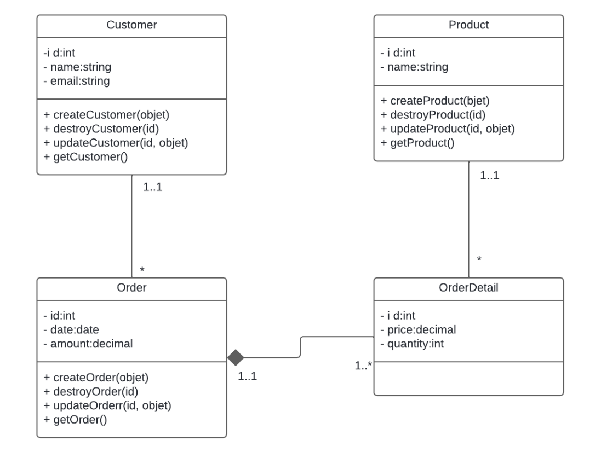

# Exo1-expressTP45

## Description

C'est une application web de gestion de projet permettant de gérer les employés, les tâches, et les assignations entre eux. L'application est développée avec Node.js et Express.js. Elle inclut des fonctionnalités CRUD (Créer, Lire, Mettre à jour, Supprimer) pour les employés et les tâches, ainsi que des fonctionnalités d'assignation et de retrait des tâches aux employés.


## Prérequis
Avant de commencer, assurez-vous d'avoir installé les éléments suivants :

- `Node.js` (version 12 ou supérieure)
- `Express.js` 
- `Body-parser` 
- `nodemon` 
  
  
   ```express
  npm install express
    ```
  ```body-parser
  npm install body-parser
  ```
   ```nodemon
  npm install nodemon
  ```

## Installation

Suivez ces étapes pour configurer le projet sur votre machine locale :

1. **Clonez le repository :**

    ```bash
   https://github.com/medbankole97/exo1-expressTP45.git
    ```

2. **Accédez au dossier du projet :**

    ```bash
   cd exo1-expressTP45
    ```

## Utilisation

Pour démarrer l'application, exécutez la commande suivante :

```bash
npm start
```


## Modélisation UML




## Auteur
[Mohamed Bankolé](https://github.com/medbankole97)